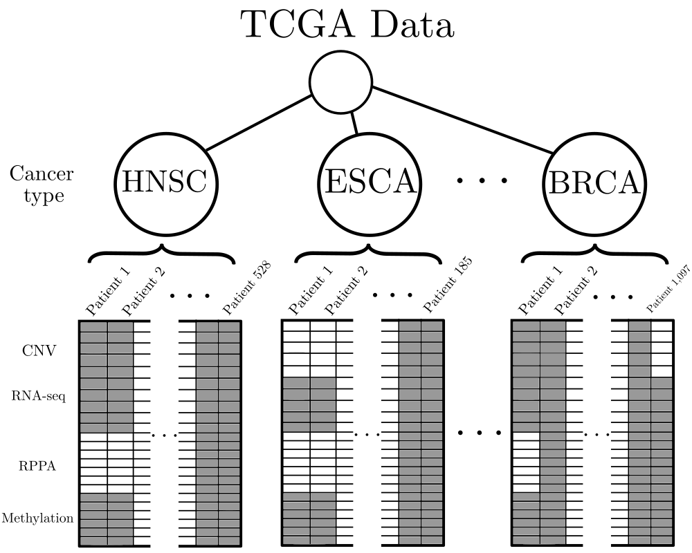

# tcga-pipeline
Downloads TCGA data and stores it in convenient HDF files.

## The Cancer Genome Atlas ([TCGA](https://www.cancer.gov/about-nci/organization/ccg/research/structural-genomics/tcga))

* TCGA includes multi-omic and clinical data, collected from 11,000+ patients divided into 38 cancer types.
* It is a really compelling dataset for supervised or unsupervised machine learning tasks.
* You can access TCGA data via [FireBrowse](http://firebrowse.org/) or the [`firehose_get`](https://broadinstitute.atlassian.net/wiki/spaces/GDAC/pages/844333139/Download) command line tool.
* Unfortunately, these tools (FireBrowse/Firehose) are inconvenient for the uninitiated. 
    - Unless you have a lot of bioinformatics background knowledge, it can be difficult to understand which data you should actually download.
    - Once you've downloaded the data, it exists as several GB of zipped text files with long, complicated names.

This repository contains a complete workflow for (i) downloading useful kinds of TCGA data and (ii) storing it in a sensible format -- an HDF file.

## Setup and execution

If you really want to run the code in this repo for yourself, then take the following steps:

1. Clone the repository: `git clone git@github.com:dpmerrell/tcga-pipeline`.
2. Set up your python environment. Install the dependencies: `pip install -r requirements.txt`.
   (I recommend doing this in a virtual environment.)
3. Make sure you have plenty of disk space. The downloads from TCGA will take ~80GB.
4. Make sure you have plenty of time. The downloads take a while -- consider running it overnight.
5. If you're feeling brave, adjust the parameters in the `config.yaml` file.
6. Run the Snakemake workflow: `snakemake --cores 1`. Using more cores doesn't necessarily buy you any speed for downloading data.

## Structure of the data

### Multi-omic data 

This workflow produces an HDF file of multi-omic data, with the structure illustrated above.

Each cancer type has its own group in the HDF file.
For each cancer type group, there are two tables:

* `/CANCERTYPE/data`. The table of multi-omic numeric values. Floating point dtype.
* `/CANCERTYPE/columns`. The list of patients. corresponds to columns in `data`. UTF-8 string dtype.

There is also a root-level table `/index` that gives the names of the multi-omic features.
Feature names take the following convention:

`GENE_DATATYPE_OTHER-IDENTIFIERS`

Possible values for `DATATYPE` include `CNV`, `METH`, `MRNA`, `PROT`.
 
There are many missing values -- not all measurements were taken for all patients.

### Clinical data

This workflow also produces an HDF file of clinical data. 
It has a similar structure to the multi-omic data.

For each cancer type there are three tables:

* `/CANCERTYPE/data`. The table of clinical data. **UTF-8 string dtype**.
* `/CANCERTYPE/columns'. The list of patients. corresponds to columns in `data`. UTF-8 string dtype.
* `/CANCERTYPE/index`. The list of clinical data features. corresponds to rows in `dataa. UTF-8 string dtype.

## Some provenance details

We download data from particular points in the [Broad Intitute GDAC Firehose pipeline](https://broadinstitute.atlassian.net/wiki/spaces/GDAC/pages/844333681/Rationale). 

* Copy number variation
    - `CopyNumber_Gistic2` node in [this DAG](http://gdac.broadinstitute.org/Analyses-DAG.html)
* Methylation
    - `Methylation_Preprocess` node in [this DAG](http://gdac.broadinstitute.org/stddata-DAG.html)
* Gene expression
    - `mRNAseq_Preprocess` node in [this DAG](http://gdac.broadinstitute.org/stddata-DAG.html)
* Reverse Phase Protein Array
    - `RPPA_AnnotateWithGene` node in [this DAG](http://gdac.broadinstitute.org/stddata-DAG.html)

## Licensing/Legal stuff

(c) David Merrell 2021

The software in this repository is distributed under an MIT license. See `LICENSE.txt` for details.

Note: downloading data from the BROAD TCGA GDAC site constitutes agreement to the TCGA Data Usage Policy: 

https://broadinstitute.atlassian.net/wiki/spaces/GDAC/pages/844333156/Data+Usage+Policy
